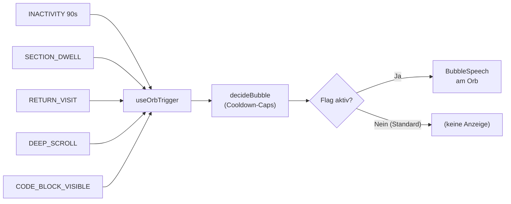
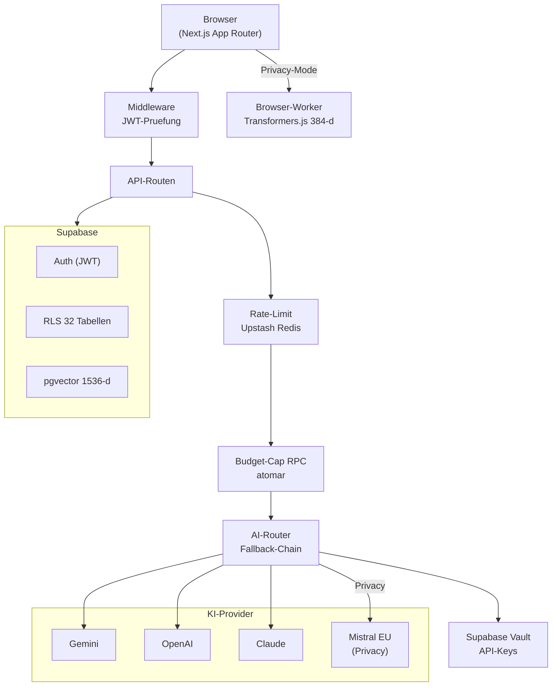
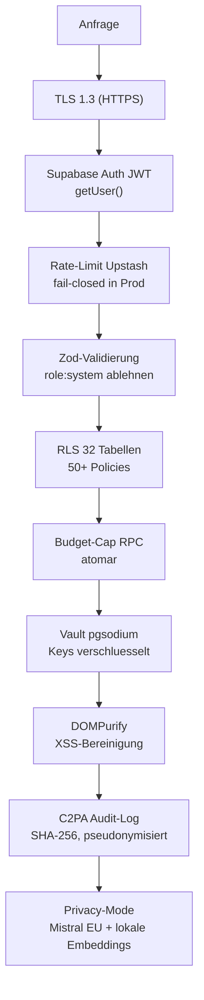

# AI Hub — Praesentation

<p align="center">
  
</p>

<p align="center">
  <strong>Deine KI-Community-Plattform mit eingebautem KI-Begleiter</strong><br>
  Lernen, teilen und wachsen mit kuenstlicher Intelligenz — fuer Teams und Organisationen.
</p>

<p align="center">
  
  
  
  
  
  
  
</p>

---

## Was ist AI Hub

AI Hub ist eine interne Community-Plattform, die Wissensaustausch, strukturiertes Lernen,
KI-Werkzeuge und Gamification in einer einzigen Anwendung vereint. Im Zentrum steht der
**Cosmos Companion** — ein animierter KI-Begleiter (der Orb), der auf jeder Dashboard-Seite
mitschwebt, RAG-gestuetzte Fragen ueber die Plattforminhalte beantwortet und per Klick ein
eingebettetes Chat-Panel oeffnet. Die Plattform verwaltet Kurse, Lernpfade, Community-Diskussionen,
Best-Practice-Artikel und einen Innovation Radar, verbindet diese Bereiche mit einem XP- und
Achievements-System und gibt Admins vollstaendige Kontrolle ueber KI-Provider, Feature-Flags
und API-Kosten — ohne Code-Deployment.

## Zielgruppe

`Teams & Unternehmen` `KI-Einsteiger & Fortgeschrittene` `Wissensmanagement` `L&D-Abteilungen` `Plattform-Admins`

---

## Screenshots

> Die Screenshots werden ergaenzt, sobald die Plattform deployed ist.
> Aufnahme-Anleitung und Dateinamen: [images/README.md](images/README.md).

| Bereich | Screenshot |
|---------|-----------|
| Dashboard mit XP, Streak und Empfehlungen |  |
| AI Orb mit geoeffnetem Chat-Panel |  |
| Command Palette (Cmd+K) |  |
| Learn Hub Kurs-Grid |  |
| Achievements-Uebersicht |  |
| Community Forum |  |
| Innovation Radar |  |
| Admin Panel |  |

---

## Feature-Hoehhepunkte

### Der Cosmos Companion (AI Orb)

Persistenter, animierter 120px-Fluid-Blob auf jeder Dashboard-Seite rechts unten.
Klick oeffnet ein 50/50-Chat-Panel mit RAG-gestuetzten Antworten aus der Best-Practices-Datenbank.
Sieben Zustaende (idle, greeting, listening, thinking, celebrating, energized, hover) kommunizieren
den KI-Status visuell. Drag-to-Dock in vier Bildschirmecken, vollstaendige Tastaturnavigation
und `prefers-reduced-motion`-Unterstuetzung.

Grenze: Tab-Reload verliert die Session-Bindung (localStorage-Persistenz ist Future Work,
ADR-005). Proaktive Sprechblasen befinden sich hinter Feature-Flag `proactive-orb-bubble`
(`defaultEnabled: false`). Drei Trigger (XP_MILESTONE, FIRST_AI_CHAT, SEARCH_NO_RESULT)
sind gebaut, haben aber aktuell keine Datenquelle.

Quellen: [features/ai-orb-companion.md](features/ai-orb-companion.md) · [features/ai-orb-search-rag.md](features/ai-orb-search-rag.md)

### Hybride Suche & RAG

Jede Orb-Chat-Anfrage wird automatisch mit Inhalten aus der Best-Practices-Datenbank angereichert
(Reciprocal Rank Fusion aus BM25-Volltext und pgvector-Cosinus-Aehnlichkeit, RLS-sicher).
Der Corpus umfasst aktuell nur die `best_practices`-Tabelle; Community-Posts und Kurse
sind noch nicht indexiert.

Quellen: [features/ai-orb-search-rag.md](features/ai-orb-search-rag.md) · [features/best-practices.md](features/best-practices.md)

### Command Palette (Cmd+K)

Globale Suchpalette von jeder Seite aus erreichbar. Ohne Eingabe: zehn Schnellnavigations-Ziele.
Mit Eingabe: 200ms-debounced Hybrid-Suche (Server) oder vollstaendig lokale 384-d-Cosinus-Suche
im Privacy-Mode (kein Netzwerk-Request). Navigiert ausschliesslich zu einer statischen Allowlist
von Pfaden — kein Open-Redirect-Risiko.

Grenze: Der lokale Corpus im Privacy-Mode ist ein Demo-Stub mit sechs Eintraegen und wird
nicht automatisch aus der Datenbank befuellt.

Quelle: [features/command-palette-search.md](features/command-palette-search.md)

### Multi-Provider AI Router

Serverseitiger Router mit konfigurierbarer Fallback-Chain: Gemini → OpenAI → Claude → Copilot.
Privacy-Mode leitet zwingend auf Mistral EU (Frankreich, DSGVO-DPA vorhanden) um.
Budget-Cap via atomarer PostgreSQL-RPC verhindert Cost-Overruns; Soft-Cap (>=80%) degradiert
auf Groq/Llama. Alle Provider-API-Keys liegen in Supabase Vault (pgsodium), nie im
Client-Bundle.

Grenze: Der Admin-Provider-Test-Sandbox nutzt aktuell ENV-Keys statt DB/Vault-Keys (bekanntes P1-Issue).

Quelle: [features/ai-provider-routing.md](features/ai-provider-routing.md)

### Learn Hub

Kurse, Lektionen, Multiple-Choice-Quizzes (70%-Schwelle, Sofort-Feedback), automatische
Zertifikate und kuratierte Lernpfade mit Stepper-UI und Enrollment. XP-Vergabe
dreifach abgesichert gegen Doppelvergabe. Drei Seed-Kurse (16 Lektionen) und drei
Seed-Lernpfade sind ab Installation vorhanden.

Quelle: [features/learn-hub.md](features/learn-hub.md)

### Community Forum & Idea Board

Vollstaendiges Forum mit verschachtelten Kommentaren (bis 4 Ebenen), Toggle-Upvote-System
und Self-Vote-Schutz per DB-Constraint. Das Idea Board erlaubt KI-gestuetzte Bewertung
von Use Cases (5 Dimensionen, Score 0-100). Auto-Tagging bei Post-Erstellung via KI.

Grenze: Echtzeit-Updates sind nicht verdrahtet; die Seite muss manuell neu geladen werden.

Quelle: [features/community.md](features/community.md)

### Gamification (XP, Badges, Streaks, Achievements)

7 Levels (0 XP bis 10.000 XP fuer "KI-Visionaer"), 20 Achievements in 4 Kategorien,
12 Community-Badges, taeglich erneuerbare Streaks mit Tier-Flammen. Der Orb wechselt
bei Achievement-Freischaltung in den "celebration"-State mit Partikelexplosion.

Quelle: [features/gamification.md](features/gamification.md)

### Sicherheit (mehrschichtig)

Supabase JWT Auth, RLS auf 32 Tabellen (50+ Policies), Rate-Limiting via Upstash Redis
(fail-closed in Production), Zod-Input-Caps auf allen API-Routen, DOMPurify auf allen
HTML-Rendering-Stellen, Budget-Cap-RPC, C2PA-konformes Audit-Log (SHA-256, Modell, Region).
Privacy-Mode hard-routet auf EU-Provider und verwendet lokale Browser-Embeddings.

Grenze: C2PA-Logs haben kein X.509-Signing (Phase-2-Scope); Admin-Lesepfad fuer Audit-Logs
fehlt (Phase-5-Scope).

Quelle: [features/security-and-privacy.md](features/security-and-privacy.md)

### Admin Panel

Sechs Module ohne Code-Deployment: KI-Provider konfigurieren und testen, Fallback-Chain
festlegen, System-Prompts versionieren, Feature-Flags global umschalten, API-Kosten
nach Provider/Zeitraum einsehen, Inhalte moderieren.

Grenze: Nutzer-Verwaltungs-UI ist ein Platzhalter (API vorhanden, UI fehlt).

Quelle: [features/admin.md](features/admin.md)

### Privacy-Mode & lokale Suche

Nutzer-Toggle in `/settings` aktiviert vollstaendig lokale Embeddings
(384-d, `all-MiniLM-L6-v2` via Transformers.js) und erzwingt Mistral EU als KI-Provider.
Keine Suchquery verlaesst den Browser. Nach dem ersten Modell-Download laeuft die Suche
ohne Netzwerkverbindung.

Grenze: Der lokale Suchcorpus ist hardcodiert (Demo-Stub); Mistral Experiment-Tier
ist nicht fuer Produktionsdaten freigegeben (siehe ADR-013-Caveats).

Quelle: [features/privacy-mode-local-search.md](features/privacy-mode-local-search.md)

---

## Der AI Orb im Fokus

Der Cosmos Companion ist der zentrale Interaktionspunkt der Plattform. Die folgende
Sequenz zeigt den vollstaendigen Weg einer Nutzeranfrage vom Klick bis zur
KI-Antwort mit RAG-Kontext.

```mermaid
sequenceDiagram
    actor Nutzer
    participant Orb as AI Orb (Browser)
    participant Route as POST /api/ai/chat
    participant Zod as Zod-Validierung
    participant Auth as requireAuth()
    participant RL as Rate-Limit (Upstash)
    participant Budget as enforceBudget() RPC
    participant Search as hybridSearchBestPractices
    participant RAG as buildRagContext()
    participant Router as AI-Router
    participant Provider as KI-Provider

    Nutzer->>Orb: Nachricht eingeben
    Orb->>Route: POST {messages, sessionId}
    Route->>Zod: Schema pruefen (max 50 Msg, 100KB, role:system ablehnen)
    Zod-->>Route: 400 bei Fehler
    Route->>Auth: Session pruefen
    Auth-->>Route: 401 ohne Token
    Route->>RL: Tier "ai" 20req/60s
    RL-->>Route: 429 bei Ueberschreitung
    Route->>Budget: Budget reservieren (atomare RPC)
    Budget-->>Route: 429 bei Limit; Soft-Cap -> Groq
    Route->>Search: Embedding + hybrid_search (RLS-sicher)
    Search-->>RAG: Top-5 Best Practices
    RAG-->>Route: Kontext fuer System-Prompt
    Route->>Router: privacyMode?
    alt Privacy-Mode aktiv
        Router->>Provider: Mistral EU exklusiv
    else Standard
        Router->>Provider: Gemini → OpenAI → Claude → Copilot
    end
    Provider-->>Orb: Stream (AbortSignal)
    Route-)Route: C2PA Audit-Log (fire-and-forget)
```

Proaktive Regeln des Orbs (hinter Feature-Flag `proactive-orb-bubble`):



Standalone-Diagramme: [diagrams/02-orb-rag-flow.md](diagrams/02-orb-rag-flow.md) · [diagrams/04-orb-proactive-rules.md](diagrams/04-orb-proactive-rules.md)

---

## Architektur auf einen Blick



Vollstaendiges Diagramm: [diagrams/01-system-architecture.md](diagrams/01-system-architecture.md)

---

## Sicherheit & Datenschutz auf einen Blick



Vollstaendiges Diagramm: [diagrams/05-security-layers.md](diagrams/05-security-layers.md) · [diagrams/06-ai-router-fallback.md](diagrams/06-ai-router-fallback.md)

---

## Tech-Stack

| Kategorie | Technologie | Version |
|-----------|------------|---------|
| Framework | Next.js (App Router, SSR) | 14.2.x |
| UI | React | 18.3.x |
| Sprache | TypeScript (strict) | 5.6.x |
| Backend / DB | Supabase (Postgres, Auth, Vault, Realtime) | 2.45.x |
| Vektorsuche | pgvector (1536-d, OpenAI text-embedding-3-small) | — |
| Lokale Embeddings | @xenova/transformers (384-d, all-MiniLM-L6-v2) | 2.17.x |
| Styling | Tailwind CSS | 3.4.x |
| State | Zustand | 5.0.x |
| Animation | Framer Motion | 11.5.x |
| AI SDK | Vercel AI SDK | 4.0.x |
| KI-Provider | Gemini, Anthropic Claude, OpenAI, Copilot (Azure) | — |
| Privacy-Provider | Mistral EU (Frankreich) | — |
| Soft-Cap-Provider | Groq / Llama | — |
| Validierung | Zod | 3.23.x |
| Rate-Limiting | @upstash/ratelimit (Sliding Window) | 2.0.x |
| Command Palette | cmdk | 1.1.x |
| XSS-Schutz | isomorphic-dompurify | 2.36.x |
| Orb-Idle-Maschine | XState | 5.31.x |
| Unit-Tests | Vitest | 4.0.x |
| E2E-Tests | Playwright | 1.58.x |

---

## Schnellstart (3 Schritte)

```bash
# 1. Repository klonen und Abhaengigkeiten installieren
git clone <repository-url> && cd ai-hub && npm install

# 2. Umgebungsvariablen konfigurieren (mindestens Supabase + ein AI-Provider)
cp .env.example .env.local

# 3. Datenbank starten und Development-Server starten
npm run supabase:reset && npm run dev
```

Vollstaendige Anleitung mit allen Umgebungsvariablen: [../README.md](../README.md)

---

## Weiterfuehrende Dokumentation

| Dokument | Inhalt |
|----------|--------|
| [README.md](../README.md) | Schnellstart, vollstaendige API-Uebersicht, Projektstruktur |
| [AI-HUB-Overview.html](AI-HUB-Overview.html) | User-Sicht: alle Features aus Nutzerperspektive |
| [features/](features/) | 18 Feature-Einzeldokumente mit Status-Tabellen |
| [diagrams/](diagrams/) | Alle Mermaid-Schaubilder als Standalone-Dateien |
| [architecture/](architecture/) | ADRs und Architektur-Entscheidungen |
| [images/README.md](images/README.md) | Screenshot-Manifest fuer Aufnahme-Anleitung |

### Feature-Dokumente (Auswahl)

- [AI Orb Companion](features/ai-orb-companion.md) — Cosmos Companion, Chat, Drag-to-Dock
- [AI Orb RAG](features/ai-orb-search-rag.md) — Hybrid Search, RAG-Context, RLS-Schutz
- [AI Provider Routing](features/ai-provider-routing.md) — Fallback-Chain, Privacy-Mode, Budget-Cap
- [Command Palette](features/command-palette-search.md) — Cmd+K, Hybrid Search, Privacy-lokale Suche
- [Security & Privacy](features/security-and-privacy.md) — alle Sicherheitsschichten im Detail
- [Privacy Mode](features/privacy-mode-local-search.md) — lokale Embeddings, Mistral EU
- [Learn Hub](features/learn-hub.md) — Kurse, Quiz, Zertifikate, Lernpfade
- [Gamification](features/gamification.md) — XP, Level, Achievements, Streaks
- [Community](features/community.md) — Forum, Idea Board, KI-Bewertung
- [Admin Panel](features/admin.md) — Provider, Feature-Flags, Kosten-Dashboard
