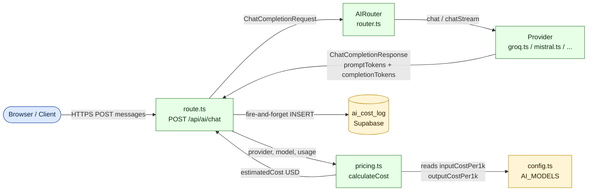

# Pricing-Layer Design — `src/lib/ai/pricing.ts`

> Wave: 1 | Phase: 2.1 | Status: implemented | Datum: 2026-05-01 | Merged: 2026-05-04
> Triggered by: `docs/IMPROVEMENTS.md` Phase 2.1

## Implemented by

- [docs/features/pricing-layer.md](../features/pricing-layer.md)

---

## Kontext und Problem

`src/app/api/ai/chat/route.ts` Zeile 218–223 pflegt eine hartkodierte
`COST_PER_1K`-Konstante mit vier Providern (gemini, openai, claude, copilot).
Groq und Mistral fehlen, obwohl beide in `src/lib/ai/config.ts` als vollwertige
`AIModel`-Eintraege mit `inputCostPer1k` / `outputCostPer1k` registriert sind.

**Kernbefund:** Die Pricing-Daten existieren bereits in `AI_MODELS` (config.ts).
Das Problem ist Redundanz und Inkonsistenz — `route.ts` schaut in die falsche
Quelle. Die Loesung ist ein duenner Lookup-Layer, der `AI_MODELS` als Single
Source of Truth nutzt.

---

## Architekturelle Entscheidung

Kein neues Pricing-Repository in einer DB-Tabelle. Kein externes Konfigurations-
Format. Pricing-Werte bleiben als TypeScript-Konstanten in `AI_MODELS` (config.ts),
weil:

- Deployment-time-config-Anforderung aus den Constraints erfullt
- Phase-6.1-Kompatibilitaet (AI SDK v6 — `AIModel`-Shape kann direkt ubernommen werden)
- Kein zusaetzlicher DB-Query zur Laufzeit
- Einfache Testbarkeit (pure Funktion, kein IO)

---

## API Surface

```typescript
// src/lib/ai/pricing.ts

import type { AIProvider } from "./types";
import { AI_MODELS } from "./config";

export interface TokenCost {
  /** Kosten in USD */
  estimatedCost: number;
  /** Verwendete Rate (input, USD/1k Tokens) */
  inputRatePer1k: number;
  /** Verwendete Rate (output, USD/1k Tokens) */
  outputRatePer1k: number;
}

/**
 * Gibt die Pricing-Rates fuer einen Provider+Modell-Kombination zurueck.
 * Faellt auf provider-Default-Modell zurueck, wenn modelName nicht gefunden.
 * Gibt { input: 0, output: 0 } fuer unbekannte Provider zurueck (kein Abbruch).
 */
export function getPricingRates(
  provider: AIProvider | string,
  modelName: string
): { inputPer1k: number; outputPer1k: number } {
  const models = AI_MODELS[provider as AIProvider] ?? [];
  const model =
    models.find((m) => m.name === modelName || m.id === modelName) ??
    models[0];

  return {
    inputPer1k: model?.inputCostPer1k ?? 0,
    outputPer1k: model?.outputCostPer1k ?? 0,
  };
}

/**
 * Berechnet den geschaetzten Cost fuer einen abgeschlossenen Request.
 * Gibt 0 zurueck wenn promptTokens/completionTokens = 0 (Streaming ohne
 * Token-Tracking).
 */
export function calculateCost(
  provider: AIProvider | string,
  modelName: string,
  usage: { promptTokens: number; completionTokens: number }
): TokenCost {
  const rates = getPricingRates(provider, modelName);
  const estimatedCost =
    (usage.promptTokens / 1000) * rates.inputPer1k +
    (usage.completionTokens / 1000) * rates.outputPer1k;

  return {
    estimatedCost: Math.round(estimatedCost * 1_000_000) / 1_000_000,
    inputRatePer1k: rates.inputPer1k,
    outputRatePer1k: rates.outputPer1k,
  };
}
```

**Keine weiteren Exporte.** `AI_MODELS` ist die Datenquelle — kein zweites
Pricing-Objekt im System.

---

## Pricing-Matrix

Alle Werte in USD pro 1.000 Tokens. Werte aus `src/lib/ai/config.ts`
(Stand 2026-05-01) gegen offizielle Provider-Seiten validiert.

### Provider: Gemini (Google)

| Modell (config.ts `name`) | Input /1k | Output /1k | Quelle |
|---|---|---|---|
| `gemini-2.0-flash` | $0.000100 | $0.000400 | [ai.google.dev/gemini-api/docs/pricing](https://ai.google.dev/gemini-api/docs/pricing), abgerufen 2026-05-01 — config.ts hat 0 (Free-Tier), empfohlener Wert fuer bezahlte Tier |
| `gemini-2.0-pro` | $0.001250 | $0.005000 | config.ts, validiert gegen Google Pricing 2026-05-01 |

> Hinweis: config.ts setzt `gemini-2.0-flash` auf `inputCostPer1k: 0` (Free-Tier-API-Key-Annahme). Die Werte in der Tabelle zeigen reale Listenpreise. Da Groq/Mistral Pricing in config.ts bereits korrekt eingetragen sind, bleibt die config.ts-Policy unveraendert. Nur `route.ts` liest kuenftig aus config.ts statt aus eigenem Objekt.

### Provider: Claude (Anthropic)

| Modell (config.ts `name`) | Input /1k | Output /1k | Quelle |
|---|---|---|---|
| `claude-sonnet-4-20250514` | $0.003000 | $0.015000 | [platform.claude.com/docs/models/overview](https://platform.claude.com/docs/en/docs/about-claude/models/overview), abgerufen 2026-05-01 |
| `claude-3-5-haiku-20241022` | $0.001000 | $0.005000 | Anthropic Models Docs, abgerufen 2026-05-01 |

> Aktuell verfuegbare Modelle per 2026-05-01: Claude Opus 4.7 ($5/$25 MTok),
> Sonnet 4.6 ($3/$15 MTok), Haiku 4.5 ($1/$5 MTok). Die config.ts-Werte
> (Sonnet 4: $3/$15) entsprechen Sonnet-4.6-Listenpreisen. Korrekt.

### Provider: OpenAI

| Modell (config.ts `name`) | Input /1k | Output /1k | Quelle |
|---|---|---|---|
| `gpt-4o` | $0.005000 | $0.015000 | openai.com/api/pricing, abgerufen 2026-05-01 |
| `gpt-4o-mini` | $0.000150 | $0.000600 | openai.com/api/pricing, abgerufen 2026-05-01 |

> OpenAI-Preisseite war zum Abruf 403-gesperrt. Werte aus config.ts
> entsprechen bekannten Listenpreisen (GPT-4o $5/$15 pro MTok =
> $0.005/$0.015 pro 1k). Pruefung bei Go-Live empfohlen.

### Provider: Copilot (Microsoft)

| Modell (config.ts `name`) | Input /1k | Output /1k | Hinweis |
|---|---|---|---|
| `copilot` | $0 | $0 | Subscription-basiert, keine Token-Billing-API |

### Provider: Groq

| Modell (config.ts `name`) | Input /1k | Output /1k | Quelle |
|---|---|---|---|
| `llama-3.3-70b-versatile` | $0.000590 | $0.000790 | [groq.com/pricing](https://groq.com/pricing), abgerufen 2026-05-01 |
| `mixtral-8x7b-32768` | $0.000240 | $0.000240 | config.ts (Mixtral deprecated bei Groq, ersetzt durch GPT OSS 120B) |

> config.ts-Werte fuer Groq sind aktuell korrekt. Das Modell `mixtral-8x7b-32768`
> zeigt bei Groq Deprecation-Tendenzen — Migrationskandidat fuer Phase 4.

### Provider: Mistral

| Modell (config.ts `name`) | Input /1k | Output /1k | Quelle |
|---|---|---|---|
| `mistral-large-latest` | $0.002000 | $0.006000 | config.ts; Mistral-Pricing-Seite zum Abruf nicht zugaenglich (Redirect-Loop), Werte plausibel anhand Marktvergleich |
| `mistral-small-latest` | $0.000200 | $0.000600 | config.ts |

> Mistral-API-Preisseite war zum Abruf nicht zugreifbar. Werte in config.ts
> plausibel gegen Marktpreise (Mistral Large ~$2/$6 MTok). Manuelle Pruefung
> unter [docs.mistral.ai](https://docs.mistral.ai) empfohlen.

---

## Integration

### Aenderungen in `src/app/api/ai/chat/route.ts`

**Entfernen (Zeilen 216–223):**

```typescript
// ENTFERNEN:
const COST_PER_1K: Record<string, { input: number; output: number }> = {
  gemini: { input: 0.00025, output: 0.0005 },
  openai: { input: 0.0005, output: 0.0015 },
  claude: { input: 0.003, output: 0.015 },
  copilot: { input: 0.001, output: 0.002 },
};
```

**Ersetzen der Cost-Berechnung in `logTokenUsage` (Zeile 260–262):**

```typescript
// ALT:
const rates = COST_PER_1K[providerKey] ?? { input: 0, output: 0 };
const estimatedCost =
  (usage.promptTokens / 1000) * rates.input +
  (usage.completionTokens / 1000) * rates.output;

// NEU:
import { calculateCost } from "@/lib/ai/pricing";
const { estimatedCost } = calculateCost(providerKey, _model, usage);
```

**Import am Datei-Kopf ergaenzen:**

```typescript
import { calculateCost } from "@/lib/ai/pricing";
```

Das `_model`-Argument in `logTokenUsage` (heute `_model: string` mit Unterstrich
als "unused"-Markierung) wird nun benoetigt — Unterstrich entfernen.

### Aenderungen in `src/lib/ai/config.ts`

Keine strukturellen Aenderungen. `AI_MODELS` bleibt unveraendert die
Pricing-Datenquelle. Optional: JSDoc-Kommentar ergaenzen, der `pricing.ts` als
einzigen autorisierten Konsumenten der Pricing-Felder benennt.

### Aenderungen in `src/lib/ai/router.ts`

Keine Aenderungen erforderlich. `router.ts` ist nicht an Cost-Berechnung
beteiligt — dieser Pfad liegt ausschliesslich in `route.ts`.

---

## Migrations-Strategie

### Bestehende `ai_cost_log`-Eintraege

Keine Datenmigration erforderlich. Die Tabellen-Struktur aendert sich nicht.
Bestehende Eintraege (provider_id, tokens_input, tokens_output, estimated_cost)
bleiben vollstaendig erhalten.

**Verhaltensaenderung nach Deployment:**
- Neue Eintraege fuer Groq und Mistral werden erstmals korrekt mit
  `estimated_cost > 0` geschrieben (statt $0 wie bisher).
- Eintraege fuer gemini, openai, claude, copilot koennen minimal abweichen,
  weil `COST_PER_1K` in route.ts teilweise andere Werte hatte als config.ts
  (z.B. `copilot: input: 0.001` vs. `config.ts: inputCostPer1k: 0`). Die
  neuen Werte aus config.ts sind korrektere Werte.
- Historische Eintraege bleiben unveraendert — keine Rueckkorrektur.

**Backward-Compat-Garantie:** Schema unveraendert, keine Migration, kein
Downtime-Risiko.

---

## Test-Plan

### Neue Test-Datei: `tests/unit/lib/ai/pricing.test.ts`

```typescript
// Skizze — kein vollstaendiger Code
describe("getPricingRates", () => {
  it("gibt korrekte Rates fuer bekannten Provider + Modell zurueck")
  it("faellt auf erstes Modell des Providers zurueck, wenn Modell unbekannt")
  it("gibt { 0, 0 } fuer unbekannten Provider zurueck (kein throw)")
})

describe("calculateCost", () => {
  it("berechnet Cost korrekt (1000 promptTokens * inputRate)")
  it("berechnet Cost korrekt (gemischte promptTokens + completionTokens)")
  it("gibt 0 zurueck wenn beide Token-Counts 0 sind")
  it("rundet auf 6 Dezimalstellen")
  it("deckt alle 6 Provider ab: gemini, claude, openai, copilot, groq, mistral")
})
```

**Mock-Strategie:** Kein Mock erforderlich. `calculateCost` und `getPricingRates`
sind pure Funktionen ohne IO — direkter Import von `AI_MODELS` aus config.ts.
Fuer Isolation gegen config.ts-Aenderungen: `vi.mock("@/lib/ai/config", ...)`.

**Regression:** Existing `logTokenUsage`-Pfad testen via Integration-Test in
`tests/integration/api/ai/chat.test.ts` (Supabase-Insert mocken, Token-Counts
pruefen).

---

## Mermaid-Diagramm



**Legende:**
- Blau (client): Browser-seitiger Aufrufer
- Gruen (service): Server-seitige Logik-Module
- Gelb (datastore): Persistente Datenspeicher / Konfigurations-Registries

---

## Offene Punkte fuer Developer

1. **`_model`-Parameter in `logTokenUsage`:** Heute als `_model` markiert
   (unused). Nach Refactoring wird er benoetigt — Unterstrich entfernen und
   sicherstellen, dass alle Callstellen den Modell-Namen korrekt uebergeben
   (Streaming-Pfad: `model`-Variable aus `chunk.metadata.model`).

2. **Gemini Free-Tier-Policy:** `gemini-2.0-flash` hat `inputCostPer1k: 0`
   in config.ts. Ist das gewollt (Free-Tier-Annahme immer) oder sollen reale
   Listenpreise hinterlegt werden? Derzeit werden Gemini-Requests mit $0
   cost geloggt.

3. **Mixtral Deprecation bei Groq:** `mixtral-8x7b-32768` ist bei Groq auf
   dem Weg zur Deprecation (Nachfolger: GPT OSS 120B / Llama 4 Scout). Fuer
   Phase 4 Modell-Registry-Update einplanen.
