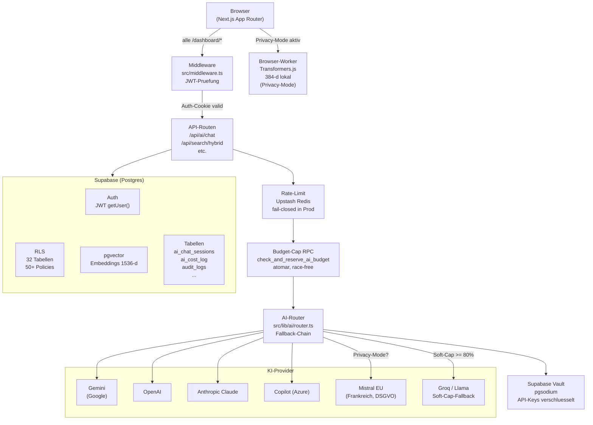

# Systemarchitektur

```mermaid
flowchart TD
    Browser["Browser\n(Next.js App Router)"]
    MW["Middleware\nsrc/middleware.ts\nJWT-Pruefung"]
    API["API-Routen\n/api/ai/chat\n/api/search/hybrid\netc."]
    AIRouter["AI-Router\nsrc/lib/ai/router.ts\nFallback-Chain"]
    RateLimit["Rate-Limit\nUpstash Redis\nfail-closed in Prod"]
    Budget["Budget-Cap RPC\ncheck_and_reserve_ai_budget\natomar, race-free"]
    Vault["Supabase Vault\npgsodium\nAPI-Keys verschluesselt"]

    subgraph Provider["KI-Provider"]
        Gemini["Gemini\n(Google)"]
        OpenAI["OpenAI"]
        Claude["Anthropic Claude"]
        Copilot["Copilot (Azure)"]
        MistralEU["Mistral EU\n(Frankreich, DSGVO)"]
        Groq["Groq / Llama\nSoft-Cap-Fallback"]
    end

    subgraph DB["Supabase (Postgres)"]
        Auth["Auth\nJWT getUser()"]
        RLS["RLS\n32 Tabellen\n50+ Policies"]
        PGVector["pgvector\nEmbeddings 1536-d"]
        Tables["Tabellen\nai_chat_sessions\nai_cost_log\naudit_logs\n..."]
    end

    LocalWorker["Browser-Worker\nTransformers.js\n384-d lokal\n(Privacy-Mode)"]

    Browser -->|"alle /dashboard/*"| MW
    MW -->|"Auth-Cookie valid"| API
    API --> RateLimit
    RateLimit --> Budget
    Budget --> AIRouter
    AIRouter -->|"Privacy-Mode?"| MistralEU
    AIRouter --> Gemini
    AIRouter --> OpenAI
    AIRouter --> Claude
    AIRouter --> Copilot
    AIRouter -->|"Soft-Cap >= 80%"| Groq
    AIRouter --> Vault
    API --> DB
    DB --- Auth
    DB --- RLS
    DB --- PGVector
    DB --- Tables
    Browser -->|"Privacy-Mode aktiv"| LocalWorker
```
