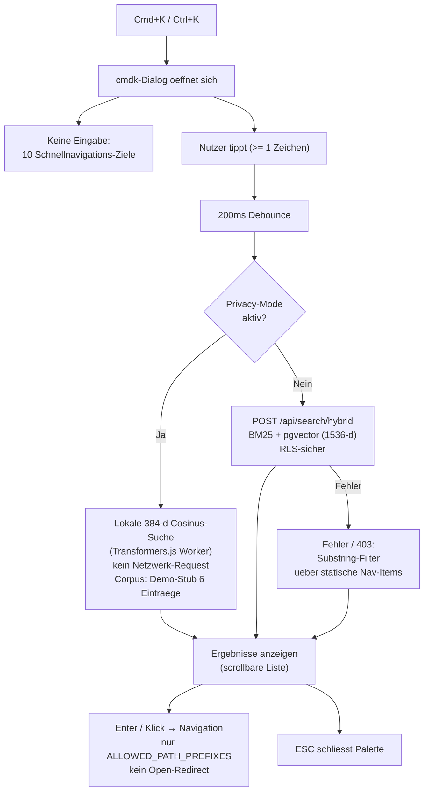

# Command Palette & Suche

```mermaid
flowchart TD
    Key["Cmd+K / Ctrl+K"]
    Dialog["cmdk-Dialog oeffnet sich"]
    Empty["Keine Eingabe:\n10 Schnellnavigations-Ziele"]
    Input["Nutzer tippt (>= 1 Zeichen)"]
    Debounce["200ms Debounce"]
    PrivacyCheck{"Privacy-Mode\naktiv?"}
    LocalSearch["Lokale 384-d Cosinus-Suche\n(Transformers.js Worker)\nkein Netzwerk-Request\nCorpus: Demo-Stub 6 Eintraege"]
    ServerSearch["POST /api/search/hybrid\nBM25 + pgvector (1536-d)\nRLS-sicher"]
    Results["Ergebnisse anzeigen\n(scrollbare Liste)"]
    Navigate["Enter / Klick → Navigation\nnur ALLOWED_PATH_PREFIXES\nkein Open-Redirect"]
    Fallback["Fehler / 403:\nSubstring-Filter\nueber statische Nav-Items"]
    ESC["ESC schliesst Palette"]

    Key --> Dialog
    Dialog --> Empty
    Dialog --> Input
    Input --> Debounce
    Debounce --> PrivacyCheck
    PrivacyCheck -->|"Ja"| LocalSearch
    PrivacyCheck -->|"Nein"| ServerSearch
    LocalSearch --> Results
    ServerSearch --> Results
    ServerSearch -->|"Fehler"| Fallback
    Fallback --> Results
    Results --> Navigate
    Results --> ESC
```
