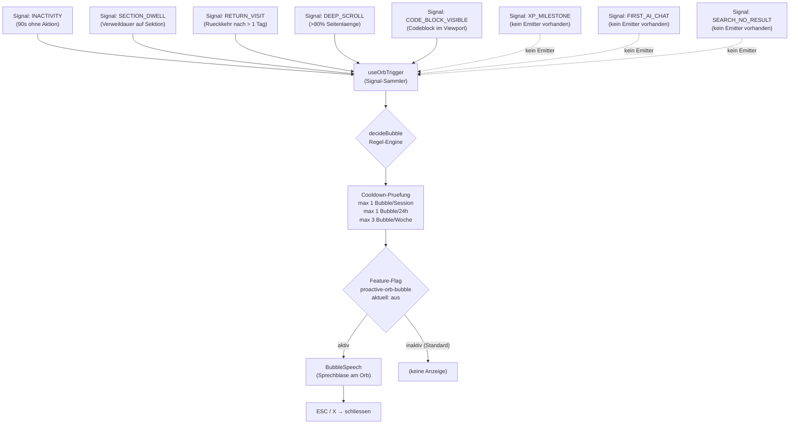

# Orb Proaktive Regeln

Hinweis: Diese Logik liegt hinter Feature-Flag `proactive-orb-bubble` (`defaultEnabled: false`).
Die Trigger XP_MILESTONE, FIRST_AI_CHAT und SEARCH_NO_RESULT sind gebaut, haben aber aktuell
keine Datenquelle und koennen nicht feuern.

