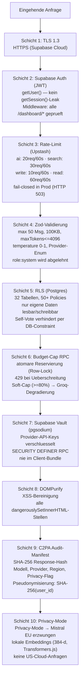

# Sicherheitsschichten

```mermaid
flowchart TD
    Request["Eingehende Anfrage"]

    L1["Schicht 1: TLS 1.3\nHTTPS (Supabase Cloud)"]
    L2["Schicht 2: Supabase Auth (JWT)\ngetUser() — kein getSession()-Leak\nMiddleware: alle /dashboard/* geprueft"]
    L3["Schicht 3: Rate-Limit (Upstash)\nai: 20req/60s · search: 30req/60s\nwrite: 10req/60s · read: 60req/60s\nfail-closed in Prod (HTTP 503)"]
    L4["Schicht 4: Zod-Validierung\nmax 50 Msg, 100KB, maxTokens<=4096\ntemperature 0-1, Provider-Enum\nrole:system wird abgelehnt"]
    L5["Schicht 5: RLS (Postgres)\n32 Tabellen, 50+ Policies\nnur eigene Daten lesbar/schreibbar\nSelf-Vote verhindert per DB-Constraint"]
    L6["Schicht 6: Budget-Cap RPC\natomare Reservierung (Row-Lock)\n429 bei Ueberschreitung\nSoft-Cap (>=80%) → Groq-Degradierung"]
    L7["Schicht 7: Supabase Vault (pgsodium)\nProvider-API-Keys verschluesselt\nSECURITY DEFINER RPC\nnie im Client-Bundle"]
    L8["Schicht 8: DOMPurify\nXSS-Bereinigung\nalle dangerouslySetInnerHTML-Stellen"]
    L9["Schicht 9: C2PA Audit-Manifest\nSHA-256 Response-Hash\nModell, Provider, Region, Privacy-Flag\nPseudonymisierung: SHA-256(user_id)"]
    L10["Schicht 10: Privacy-Mode\nPrivacy-Mode → Mistral EU erzwungen\nlokale Embeddings (384-d, Transformers.js)\nkeine US-Cloud-Anfragen"]

    Request --> L1 --> L2 --> L3 --> L4 --> L5 --> L6 --> L7 --> L8 --> L9 --> L10
```
