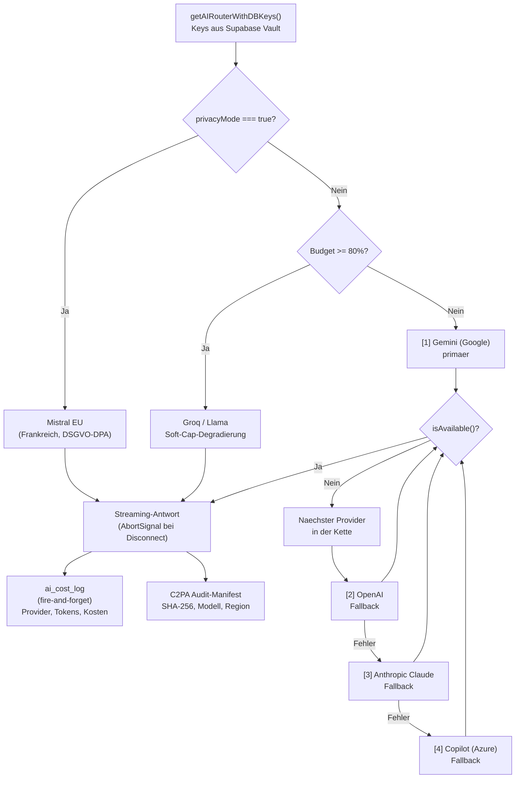

# AI-Router Fallback-Chain

```mermaid
flowchart TD
    Start["getAIRouterWithDBKeys()\nKeys aus Supabase Vault"]
    PrivacyCheck{"privacyMode === true?"}
    MistralEU["Mistral EU\n(Frankreich, DSGVO-DPA)"]
    P1["[1] Gemini (Google)\nprimaer"]
    P2["[2] OpenAI\nFallback"]
    P3["[3] Anthropic Claude\nFallback"]
    P4["[4] Copilot (Azure)\nFallback"]
    SoftCap{"Budget >= 80%?"}
    Groq["Groq / Llama\nSoft-Cap-Degradierung"]
    Available{"isAvailable()?"}
    Next["Naechster Provider\nin der Kette"]
    Stream["Streaming-Antwort\n(AbortSignal bei Disconnect)"]
    CostLog["ai_cost_log\n(fire-and-forget)\nProvider, Tokens, Kosten"]
    Manifest["C2PA Audit-Manifest\nSHA-256, Modell, Region"]

    Start --> PrivacyCheck
    PrivacyCheck -->|"Ja"| MistralEU
    PrivacyCheck -->|"Nein"| SoftCap
    SoftCap -->|"Ja"| Groq
    SoftCap -->|"Nein"| P1
    P1 --> Available
    Available -->|"Ja"| Stream
    Available -->|"Nein"| Next
    Next --> P2 --> Available
    P2 -->|"Fehler"| P3 --> Available
    P3 -->|"Fehler"| P4 --> Available
    MistralEU --> Stream
    Groq --> Stream
    Stream --> CostLog
    Stream --> Manifest
```
